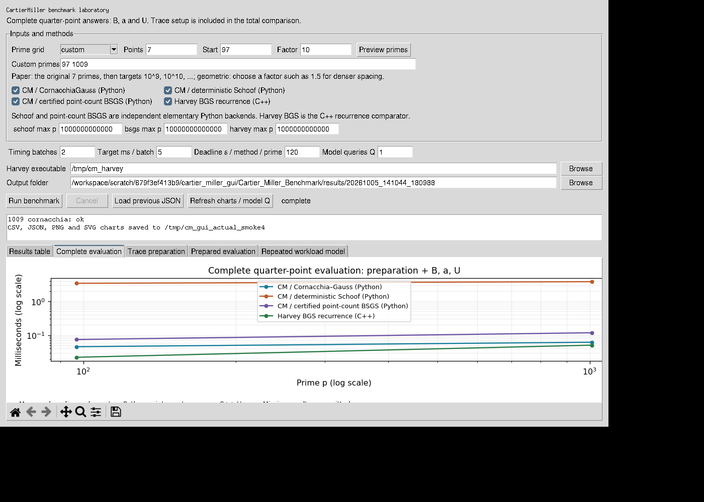

# Cartier–Miller benchmark laboratory

A desktop application for comparing complete quarter-point Cartier–Miller evaluation with the retained Harvey Bostan–Gaudry–Schost recurrence comparator. The default run uses the paper's seven primes, saves an Excel-ready table, and generates charts. Independent elementary Python implementations of deterministic Schoof and certified point-counting BSGS can replace Cornacchia–Gauss preparation.

This is research software accompanying a draft awaiting specialist review. The new point counters are independently implemented experimental backends, not highly optimized production implementations. Their measured performance must be identified as such.



## What is calculated?

For a prime $p\equiv1\pmod4$, the stopping index is $n=(p-1)/4$. Every successful complete evaluation returns the same three residues:

$$
a_n=\binom{2n}{n}8^{-n}\pmod p,
\qquad B_n=\sum_{i=0}^{n-1}\binom{2i}{i}8^{-i}\pmod p,
$$

$$
U_p(n)=4B_n+\frac94a_n\pmod p.
$$

The elliptic model is $E:y^2=x^3+2x$. Its exact trace is $\tau=p+1-\lvert E(\mathbb F_p)\rvert$. Each preparation backend supplies this trace to the retained Miller evaluator. The boundary is $a_n\equiv\tau\pmod p$ for this specific application. The default classical path retains the original `quarter(p)` evaluator.

| GUI method | Actual implementation | Role |
|---|---|---|
| CM / Cornacchia–Gauss (Python) | Original classical preparation, including its deterministic nonresidue scan | Complete specialized quarter-point evaluation |
| CM / deterministic Schoof (Python) | Division polynomials, Frobenius characteristic equation, D5 splitting, CRT | Independently computed exact trace, then the same Miller evaluation |
| CM / certified point-count BSGS (Python) | Hasse-interval baby-step giant-step intersections on the curve and its quadratic twist | Independently computed exact trace, then the same Miller evaluation |
| Harvey BGS recurrence (C++) | Retained adapter and unchanged Sage-distributed David Harvey interval-product source | Directly computes the complete prefix, boundary and original sum |

**BGS** means Bostan–Gaudry–Schost; **BSGS** means baby-step giant-step. They are different algorithms. The point-count BSGS backend does not compute the truncated sum directly. No backend silently substitutes a CM formula for Schoof or BSGS.

## Windows setup

Install [MSYS2](https://www.msys2.org/), open its **UCRT64** terminal, and update it according to the MSYS2 installation instructions. Install the matching compiler, arithmetic libraries, Python, Tk and Matplotlib packages:

```bash
pacman -S --needed mingw-w64-ucrt-x86_64-gcc mingw-w64-ucrt-x86_64-ntl mingw-w64-ucrt-x86_64-gmp mingw-w64-ucrt-x86_64-python mingw-w64-ucrt-x86_64-tk mingw-w64-ucrt-x86_64-python-matplotlib
```

Extract the complete package to a writable folder and double-click **`run_windows.cmd`**. It builds the native Windows Harvey adapter and opens the application. Existing Visual Studio build tools alone do not supply the required NTL/GMP environment. Once built, `run_windows.cmd --skip-build` reuses the executable. If MSYS2 is installed somewhere other than `C:\msys64`, set `MSYS2_ROOT` before starting the launcher:

```bat
set "MSYS2_ROOT=D:\msys64"
run_windows.cmd
```

The calculation engine, C++ build, CSV export and charts have been tested on Linux. Native Windows execution has not been tested here. Run `python -m unittest test_validation -v` with the selected MSYS2 Python and inspect the first benchmark's validation statuses before using local timings in the paper.

Official dependency references are [MSYS2 Python](https://www.msys2.org/docs/python/), [UCRT64 Python](https://packages.msys2.org/packages/mingw-w64-ucrt-x86_64-python), [Matplotlib](https://packages.msys2.org/packages/mingw-w64-ucrt-x86_64-python-matplotlib) and [NTL](https://packages.msys2.org/packages/mingw-w64-ucrt-x86_64-ntl). Use one consistent UCRT64 environment.

A standard Windows Python installation can also run `python app.py` after `python -m pip install -r requirements.txt`. To include Harvey, first build the adapter with MSYS2, select its executable in the GUI, and make the matching UCRT64 DLL directory available on `PATH` before launching standard Python. The single-environment launcher is simpler.

## Linux and WSL

On Ubuntu, install the build and GUI dependencies, build the adapter, and launch the app in an environment with a graphical display:

```bash
sudo apt-get install build-essential libntl-dev libgmp-dev python3 python3-tk python3-matplotlib
bash build.sh
python3 app.py
```

WSL needs a working graphical environment, such as WSLg, for the desktop interface. The headless command below runs without a display. It still requires the declared Python imports, including Tkinter and Matplotlib.

## Prime grids and larger runs

The initial preset is exactly `97, 1009, 10009, 100049, 1000033, 10000121, 100000037`. With **paper** mode and 8, 9 or 10 points, it retains these inputs and extends at targets $10^9,10^{10},10^{11}$, choosing the first prime at or above each target that is $1\pmod4$.

**1,000,000,007 is 3 modulo 4 and is excluded from this quarter-point experiment.** The eighth preset input is **1,000,000,009**. The app does not change the stopping-point problem to accommodate an inadmissible prime.

With **geometric** mode, the start and multiplication factor determine targets. A factor of `10` gives decade spacing; `2` or `1.5` gives a denser plot. **custom** mode accepts comma-separated or space-separated primes. Use **Preview primes** to inspect the actual inputs. Duplicate or invalid primes are rejected. The supported input range is $13\le p<2^{63}$; this supports the deterministic 64-bit primality test and is not a promise of practical running time throughout that range.

Each method/input has a configurable deadline, initially 120 seconds. Separate maximum-prime settings initially limit Harvey and Schoof to $10^{12}$ and point-count BSGS to $10^{13}$. These are operational limits, not mathematical bounds, and can be changed. Inputs above a limit are recorded as `skipped`; deadlines give `timeout`. Missing timings remain blank and are omitted from charts. Large recurrence runs can consume substantial memory; this application does not measure or enforce a memory limit. Increase sizes gradually.

**Cancel** terminates the active calculation and retains completed measurements. Output folders are timestamped. Existing benchmark folders are not overwritten by the normal run controls.

## Tables, charts and saved records

| File | Contents |
|---|---|
| `paper_table.csv` | One row per prime, modular answers, each backend's status, total time and CM component times |
| `summary.csv` | One row per prime/backend, median/minimum/maximum complete timing, component medians and any error |
| `samples.csv` | Every timing batch mean, component name and calls per batch |
| `benchmark.json` | Full results, settings, source hashes, platform and C++ version information |
| `total.png`, `total.svg` | Complete evaluation including preparation, with Harvey on the same axes |
| `preparation.png`, `preparation.svg` | Cornacchia–Gauss, Schoof and point-count BSGS trace preparation |
| `query.png`, `query.svg` | Miller quarter-point evaluation with an exact trace already supplied |
| `amortized.png`, `amortized.svg` | An explicitly labelled repeated-workload model from measured components |

CSV and JSON files are updated after every completed backend/input. Charts are saved when the run finishes or is cancelled normally. A forced application shutdown may leave the completed CSV/JSON records without charts. The chart tabs include Matplotlib's navigation and save toolbar. **Load previous JSON** restores a run for inspection.

The repeated-workload tab uses $T_{\rm prep}+Q T_{\rm query}$ for CM and $Q T_{\rm complete}$ for Harvey. It is an illustration of repeating the evaluator at the same quarter point without caching the answer; it does not benchmark $Q$ distinct generic queries, an optimal batch algorithm, or reuse of Harvey interval-product work. The independently measured complete total is used for the principal chart and can differ from the sum of component medians.

CSV uses commas, decimal points, UTF-8 and a byte-order mark. In Excel, import with **Data → From Text/CSV**. For primes, indices or residues with more than 15 decimal digits, import those columns as **Text** to avoid Excel's numeric rounding. The saved CSV/JSON integer values retain full precision.

## Reproduce without the GUI

```bash
python3 app.py --headless --backends cornacchia,schoof,bsgs,harvey --output results/all_four
python3 app.py --headless --count 10 --backends cornacchia,harvey --output results/ten_primes
python3 app.py --headless --mode geometric --start 97 --factor 1.5 --count 30 --backends cornacchia,bsgs,harvey --output results/dense_grid
python3 app.py --headless --mode custom --primes "97 1009 1000000009" --backends schoof,harvey --output results/custom
python3 -m unittest test_validation -v
```

`python3 app.py --help` exposes timing settings, backend limits and executable selection. The retained `pilot.py` is also included for its original broader Harvey validation routine; it is not the new GUI harness.

## Timing interpretation

All successful methods compute the complete $B_n,a_n,U_p(n)$, not just a prefix. The complete CM measurement recomputes trace preparation for every call; the separate prepared-query measurement reuses one exact trace. The Harvey total includes its NTL context/model setup, interval-product kernel and extraction. Neither comparison includes process startup, IPC, primality testing, reference validation, compilation or export.

The default is 11 timing batches, calibrated toward 25 ms per batch with at most 2000 calls. Reported times are medians of per-call batch means. Code and persistent Harvey processes are warmed; library-global state can remain warm. Method order is rotated across primes. This is a new protocol, with component timings and separate spawned jobs; it does not reproduce the historical alternating two-method pilot protocol exactly. Retain both protocols when discussing old and new results.

The new elementary Python Schoof backend is intentionally algorithm-specific. Its timings illustrate this implementation's preparation cost. They do not estimate an optimized C++ Schoof implementation or SEA, and do not establish a hardware-independent crossover. Likewise, the custom point-count BSGS implementation is not Sage's optimized production counter. Language, arithmetic library, warm state and shared-host variability remain relevant.

The independent counters and the complete calculation are checked before timings are accepted. Reference checks use the classical quarter evaluator outside the timed region. The test suite separately checks point counts against direct character sums and complete sums against the original rational-sequence recurrence for small primes. Each demonstration run includes a `source_snapshot` matching its recorded hashes; final GUI layout adjustments may postdate those measurements. The package includes a fresh seven-prime demonstration run in `example_results/paper_seven`; those measurements are not replacement paper data unless explicitly adopted. `VALIDATION.md` records the validation scope.

This quarter-point app exercises Schoof preparation for one specific elliptic family. It does not validate the paper's full generic-curve Corollary 4 workload or all exceptional normalizations. The characteristic-$p$ proof does not itself change the retained quarter evaluator or speed it up.

## Mathematical notes for reviewers

`point_count.py` computes Schoof residues by evaluating $\pi^2+[p]=[t]\pi$ on odd-prime torsion, represented in polynomial quotient algebras. A noninvertible denominator splits the division-polynomial modulus by a gcd; both components are checked. Rational $(0,0)$ gives the trace residue modulo 2. CRT moduli are accumulated until their product exceeds the integer Hasse interval width. No numerical square-root approximation determines the stopping bound.

For BSGS, every true group order lies in the Hasse interval and annihilates every rational point. The counter intersects **all** interval annihilators for successive points on the curve and its quadratic twist, reflecting twist orders by $N+N'=2(p+1)$. A singleton certifies the order. It retains all low-order collision matches; it never assumes one point generates the whole group. If the configured search does not certify a unique order it reports an error, rather than guessing or reverting to Cornacchia. This backend makes no deterministic polynomial-time setup claim.

## Add to GitHub

Place the contents of the extracted `Cartier_Miller_Benchmark` folder at your repository root, including `upstream`, `example_results`, and `.github`. The supplied `.gitignore` excludes local builds and new runs. Keep the provenance and copying files with the source. The included GitHub Actions workflow builds Harvey and runs arithmetic and export checks on Linux; it is not a mathematical peer review.

## Provenance and licensing

The Harvey sources in `upstream` are unchanged from the retained pilot. Their original notices, copying text, commit and hashes are preserved in `upstream/SOURCE_PROVENANCE.json`. The adapter and new GUI, point counters, harness, tests and launchers carry GPL-2.0-or-later notices. `elliptic_prefix.py` retains the archived project's original notice; this package does not invent a separate third-party license for that file. Review your project's licensing when publishing. The independently written point counters do not vendor Peter Dinges' Python Schoof implementation.

The core literature is Schoof (1985), *Elliptic curves over finite fields and the computation of square roots mod p*, and Bostan, Gaudry and Schost (2007), *Linear recurrences with polynomial coefficients and application to integer factorization and Cartier–Manin operator*. The app is an implementation and validation companion, not evidence of mathematical novelty.
